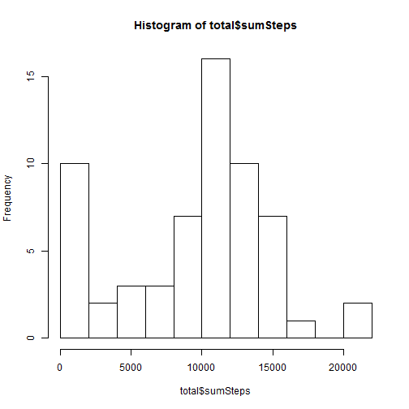
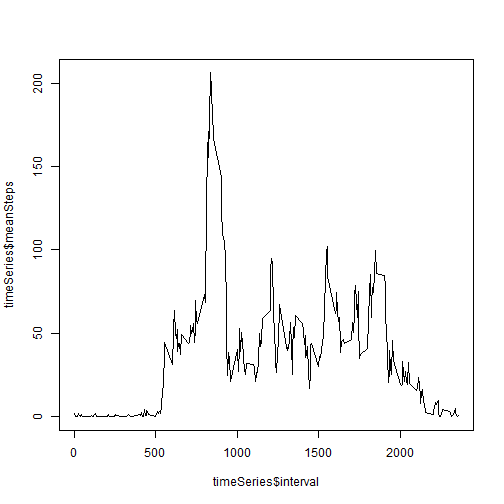
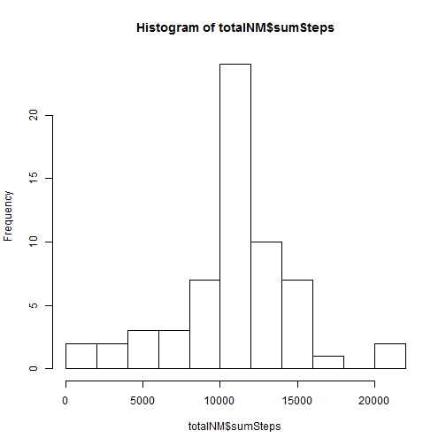
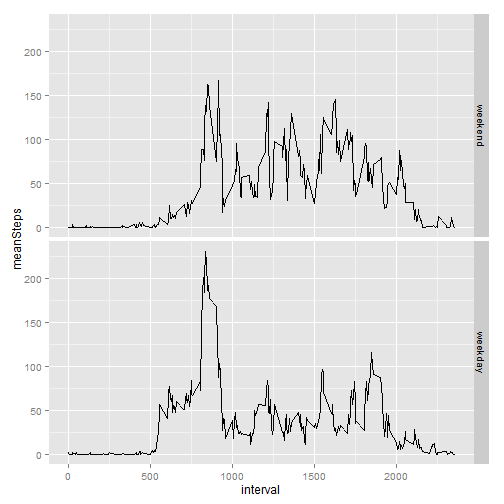

## Loading and preprocessing the data
The activity.csv is loaded into R. The date of the dataset is identified as factor, so I transform them back into date format.

```r
data <- read.csv(unz("activity.zip",'activity.csv'))
data$date <- as.Date(data$date)
str(data)
```

```
## 'data.frame':	17568 obs. of  3 variables:
##  $ steps   : int  NA NA NA NA NA NA NA NA NA NA ...
##  $ date    : Date, format: "2012-10-01" "2012-10-01" ...
##  $ interval: int  0 5 10 15 20 25 30 35 40 45 ...
```


## What is mean total number of steps taken per day?
After the data processing, a summary of the mean total number of steps taken per day is presented. For easier data manupulation, package "dplyr" is used.  
A histogram is used to show the frequency of total number of steps, breaked into 10 parts.

```r
library(dplyr)
total <- group_by(data, date) %>% summarise(sumSteps = sum(steps,na.rm = TRUE))
hist(total$sumSteps,breaks = 10)
```

 

Then, we can now have a look on the mean and median of the total number of steps per day.

```r
mean(total$sumSteps)
```

```
## [1] 9354.23
```

```r
median(total$sumSteps)
```

```
## [1] 10395
```
The mean total number of steps per day is 9354.2295082 and median total number of steps per day is 10395


## What is the average daily activity pattern?
We now try to evaluate the daily trend to activity. The data is now grouped by time interval, and a line plot is plotted.


```r
timeSeries <- group_by(data, interval) %>% summarise(meanSteps = mean(steps,na.rm = TRUE))
plot(x= timeSeries$interval, y=timeSeries$meanSteps, type = 'l')
```

 


```r
filter(timeSeries,meanSteps == max(timeSeries$meanSteps))
```

```
## Source: local data frame [1 x 2]
## 
##   interval meanSteps
## 1      835  206.1698
```
The graph suggested that the 835 interval have the maximun mean number of steps.


## Imputing missing values
From the dataset, it is found that there is many rows with steps not found. We would like to find out the impact of the missing values. We first find out the total number of rows with missing value.

```r
nrow(filter(data, is.na(steps)))
```

```
## [1] 2304
```
There is 2304 rows. I decided to change the NA value into the rounded down mean value of that interval.


```r
dataNoMiss <- data
dataNoMiss$steps[is.na(dataNoMiss$steps)]<- left_join(filter(dataNoMiss, is.na(steps)),round(timeSeries))$meanSteps
```

```
## Joining by: "interval"
```
A histogram is plotted to see if there is a impact on the missing values


```r
totalNM <- group_by(dataNoMiss, date) %>% summarise(sumSteps = sum(steps,na.rm = TRUE))
hist(totalNM$sumSteps,breaks = 10)
```

 

It is shown that a sharp decrease in frequency of first bar is recorded.  
Then, we can now have a look on the mean and median of the total number of steps per day, if the missing values are filled.

```r
mean(totalNM$sumSteps)
```

```
## [1] 10765.64
```

```r
median(totalNM$sumSteps)
```

```
## [1] 10762
```
The mean total number of steps per day is 1.0765639 &times; 10<sup>4</sup> and median total number of steps per day is 1.0762 &times; 10<sup>4</sup>. Both mean and median recorded a significant increase, when the missing values are filled with rounded-up mean steps recorded.


## Are there differences in activity patterns between weekdays and weekends?
For most of the people, there should be a difference in activity pattern for weekdays and weekends -- most people work regularly in weekdays, while they will rest in weekends, right?  
In this part, we try to analyse if there is a different activity pattern for weekdays and weekends. A factor is created to show if the records are recorded in weekday or weekend, using weekdays() function.


```r
library(timeDate)
dataNoMiss <- mutate(dataNoMiss, day = factor(isWeekday(dataNoMiss$date),labels = c("weekend","weekday")))
```
Line plots of average activity for weekday and weekend is plotted respectively.   

```r
dataPerIntervalNM <- group_by(dataNoMiss, interval, day)
timeSeriesDay <- group_by(dataNoMiss, interval, day) %>% summarise(meanSteps = mean(steps,na.rm = TRUE))
library(ggplot2)
qplot(interval, meanSteps, data = timeSeriesDay, geom = "line", facets = day~.)
```

 

The graphs suggested that, activity in weekend is spreaded from 500 to 2000 interval, while activity in weekday is focused in 500-1000 interval.
